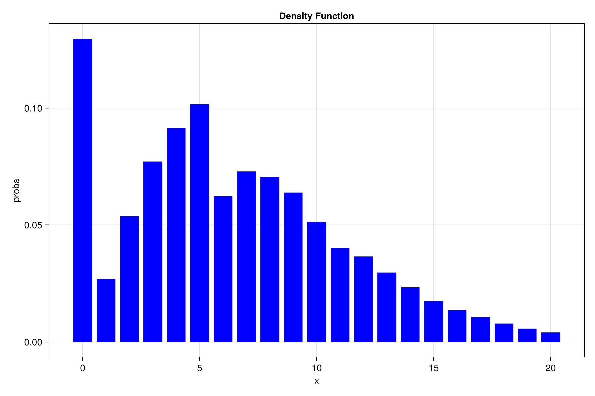

# Fórmula de De Pril

Presentaremos a continuación la fórmula de De Pril. Este resultado fue demostrado por Nelson De Pril en 1986 y proporciona una expresión exacta, aunque recursiva, de la distribución de probabilidad de un riesgo en el modelo individual. La fórmula es bastante general aunque presupone que las reclamaciones toman los valores en el conjunto $\{1, 2, \dots \}$. Este supuesto no es realmente una restricción fuerte, pues en la práctica el pago de siniestros se realiza siempre usando alguna unidad monetaria.

Para establecer la fórmula de De Pril, es necesario dividir el portafolio de $n$ asegurados de acuerdo a la tasa de mortalidad y la suma asegurada. Denotaremos por $n_{ij}$ el número de asegurados que tienen probabilidad de reclamación $q_j$ y monto de reclamación $i$, en donde $i$ toma valores en $\{1, 2, \dots, I\}$, y $j$ en $\{1, 2, \dots, J\}$. De esta forma, se tiene la tabla de la Figura 1.3, en donde la suma de las entradas es $n$, es decir,

$$
n = \sum_{i=1}^I \sum_{j=1}^J n_{ij}.
$$

Denotaremos por $Y_{ij}$ el monto real reclamado por un asegurado cuya probabilidad de reclamación es $q_j$, y el posible monto reclamado $i$, es decir:

$$
\begin{array}{|c|c|c|c|c|c|}
\hline
\textbf{Monto de la reclamación} & q_1 & q_2 & \cdots & q_j & q_J \\
\hline
1 & n_{11} & n_{12} & \cdots & n_{1j} & n_{1J} \\
\hline
2 & n_{21} & n_{22} & \cdots & n_{2j} & n_{2J} \\
\hline
\cdots & \cdots & \cdots & \cdots & \cdots & \cdots \\
\hline
i & n_{i1} & n_{i2} & \cdots & n_{ij} & n_{iJ} \\
\hline
\cdots & \cdots & \cdots & \cdots & \cdots & \cdots \\
\hline
I & n_{I1} & n_{I2} & \cdots & n_{Ij} & n_{IJ} \\
\hline
\end{array}
$$


$$
Y_{ij} = \begin{cases} 
0 & \text{con probabilidad } 1 - q_j, \\
i & \text{con probabilidad } q_j.
\end{cases}
$$

# $\textbf{{Teorema 1.1 (Fórmula de De Pril I)}}$

Sea  $n_{ij}$ el número de pólizas cuyos asegurados tienen tasa de mortalidad $ q_j $ y suma asegurada \( i \).  
Suponga que $j = 1, 2, \dots, J $, e $ i = 1, 2, \dots, I $. Entonces las probabilidades $ g_x = P(S = x) $, están dadas por:

$$
g_x = \frac{1}{x} \sum_{i=1}^I \sum_{k=1}^{\lfloor x / i \rfloor} g_{x - ik} \, h(i, k), \quad \text{para } x \geq 1
$$

$$
g_0 = \prod_{i=1}^I \prod_{j=1}^J (1 - q_j)^{n_{ij}}
$$

donde:

$$
h(i, k) = i(-1)^{k-1} \sum_{j=1}^J n_{ij} \left( \frac{q_j}{1 - q_j} \right)^k
$$

Notas Extraidas de : http://lya.fciencias.unam.mx/lars/libros/riesgo.pdf


```julia
# Define the `Portafolio` structure
struct Portafolio
    insured_matrix::Matrix{Int64} 
    probabilities::Vector{Float64} 

    function Portafolio(insured_matrix, probabilities)
        I, J = size(insured_matrix)
        return new(insured_matrix, probabilities)
    end
end


probabilidades = [0.01, 0.1, 0.03]
matriz_de_asegurados = [ 
    1 3 1;
    3 5 4;
    3 5 7;
    4 5 6;
    1 2 3;
    1 2 3;
]


portafolio = Portafolio(matriz_de_asegurados, probabilidades)
```

```julia
# Function `h` calculates auxiliary values for the portfolio
@inline function h(p::Portafolio, i::Int64, k::Int64)
    probabilities = p.probabilities
    insured_matrix = p.insured_matrix
    sum_ = 0
    for j in 1:size(insured_matrix, 2)
        sum_ += insured_matrix[i, j] * ((probabilities[j] / (1 - probabilities[j]))^k)
    end
    return (i * (-1)^(k - 1)) * sum_
end

# Recursive version of `pril_1` to calculate probabilities
function pril_1(p::Portafolio, x::Int64)
    insured_matrix = p.insured_matrix
    probabilities = p.probabilities

    I, J = size(insured_matrix)

    s_max = sum((1:I) .* sum(insured_matrix, dims=2))

    if x > s_max
        return 0
    end

    g0 = 1
    @inbounds for i in 1:I
        for j in 1:J
            g0 *= ((1 - probabilities[j])^insured_matrix[i, j])
        end
    end
    if x == 0
        return g0
    end

    sum_ = BigFloat(0)
    for i in 1:min(x, I)
        for k in 1:floor(x / i)
            sum_ += pril_1(p, Int64(x - i * k)) * h(p, i, Int64(k))
        end
    end
    return 1 / x * sum_
end

pril_2(portafolio, 5)

# Memoized version of pril_1 to calculate all probabilities
function pril_1(p::Portafolio)
    insured_matrix = p.insured_matrix
    probabilities = p.probabilities

    I, J = size(insured_matrix)
    proba = Dict{Int64, Float64}() # Dictionary to store probabilities
    s_max = sum((1:I) .* sum(insured_matrix, dims=2))

    g0 = 1
    @inbounds for i in 1:I
        for j in 1:J
            g0 *= ((1 - probabilities[j])^insured_matrix[i, j])
        end
    end
    proba[0] = g0

    x = 1
    @inbounds while x <= s_max
        suma = BigFloat(0)
        for i in 1:min(x, I)
            for k in 1:floor(x / i)
                suma += proba[x - i * k] * h(p, i, Int64(k))
            end
        end
        proba[x] = (1 / x) * suma
        x += 1
    end
    return proba
end
```





# $\textbf{Fórmula de De Pril II} $

## Fórmula de De Pril II

Sean $X_1, X_2, \ldots, X_n$ v.a.i.i.d. con valores en el conjunto $\{0, 1, 2, \ldots\}$.  
Para cada entero $j \geq 0$, defina la probabilidad $f_j = P(X = j)$, y suponga $f_0 \neq 0$.  
Sea $S = X_1 + \cdots + X_n$. Entonces las probabilidades $g_x = P(S = x)$ se calculan como:

$$g_0 = (f_0)^n $$

$$
g_x = \frac{1}{f_0} \sum_{j=1}^x \left[ j \left( \frac{n+1}{x} \right) - 1 \right] f_j g_{x-j}, \quad \text{para } x \geq 1.
$$

Notas extraidas de :  http://lya.fciencias.unam.mx/lars/libros/riesgo.pdf

```julia

# Alternative recursive probability calculation
function pril_2(n::Int, f::Array)
    if n == 0
        return (f[1])^n
    end

    s = BigFloat(0)
    for j in 1:n
        if j + 1 > length(f)
            break
        end
        s += (((j * (n + 1)) / n) - 1) * f[j + 1] * pril_2(n - j, f)
    end
    s *= (1 / f[1])
    return s
end

# Example usage of pril_2
pril_2(1, [0.5, 0.3, 0.2])

```